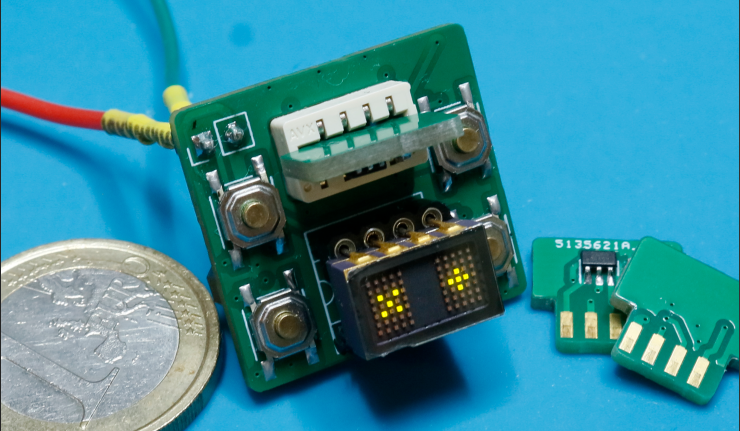
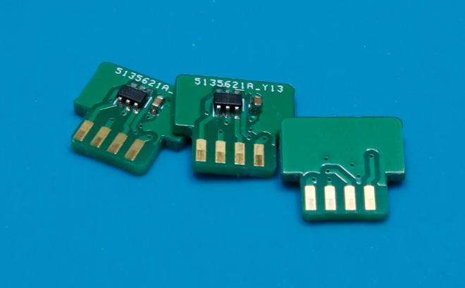

# EMES - Epic Minimalist Entertainment System

**EMES** - is a very minimalistic DIY handheld game console. 

Work in progress.

EMES has the following specifications:

 - Screen: 10x7 pixels, LED
 - Input: four button keyboard
 - Sound: Magnetic buzzer
 - Physical dimensions(approx): 25x24x18mm 
 - Removeable 8-pin cartridges

The console doesn't have an onboard CPU/MCU, instead an MCU is placed on every removable cartridge.

Each cartridge features an ATTiny10 MCU with the following specs:

 - Speed 8MHz
 - Peogram/data flash: 1KB
 - RAM: 32 bytes
 - IO: 4
 - ADC: 8bit

## Games

Currently, just one game is implemented and is playable - a variation of Pong

## Planned games

At least, variations of these classics are planned to be implemented: **Snake**, **Simon says**, **Breakout/Arcanoid**

## Other things to do

 - Additional PCB for battery powering/charging
 - Plastic 3d-printed case

