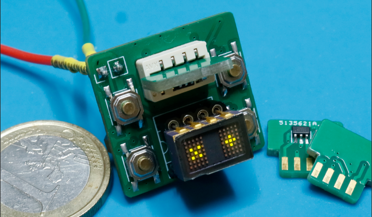
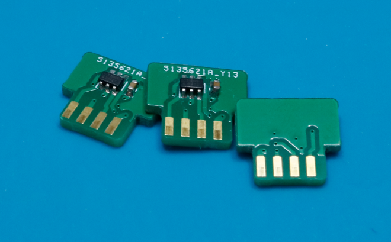

# EMES - Epic Minimalist Entertainment System

**EMES** - is a very minimalistic DIY handheld game console. 

Work in progress.

EMES has the following specifications:

 - Screen: 15x10 pixels, LED
 - Input: four button keyboard
 - Sound: Magnetic buzzer
 - Physical dimensions(approx): 40x32x14mm 
 - Removeable 8-pin cartridges

The console doesn't have an onboard CPU/MCU, instead an MCU is placed on every removable cartridge.

Each cartridge features an ATTiny10 MCU with the following specs:

 - Speed 8MHz
 - Peogram/data flash: 1KB
 - RAM: 32 bytes
 - IO: 4
 - ADC: 8bit

## Games

 - Pong
 - Snek - a snake variant, edge wrapping
 - Egg -  a N1ntend0 Game & Watch-like egg-catching game 
 - Brik - a Tetris-like
 - Simon - Simon Says